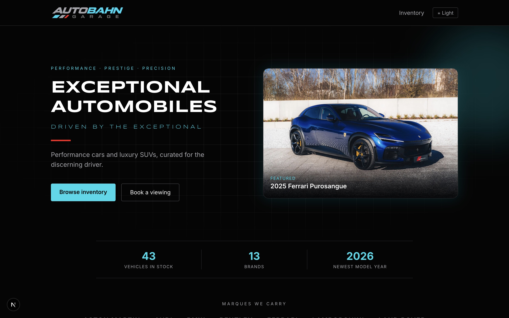
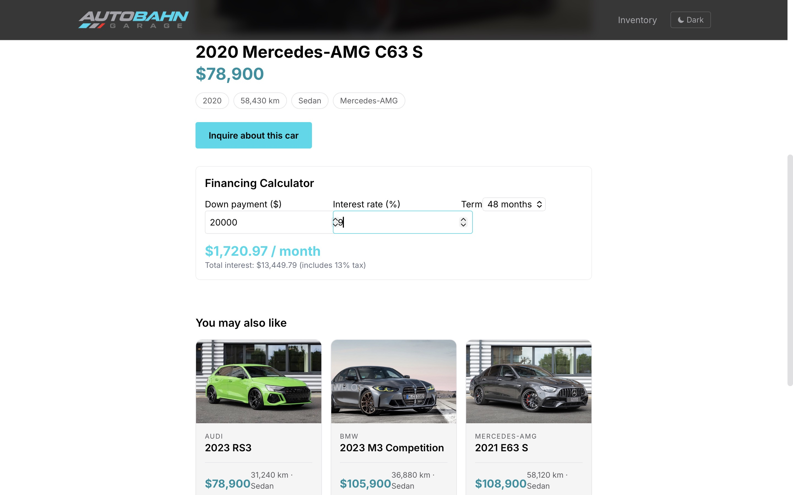
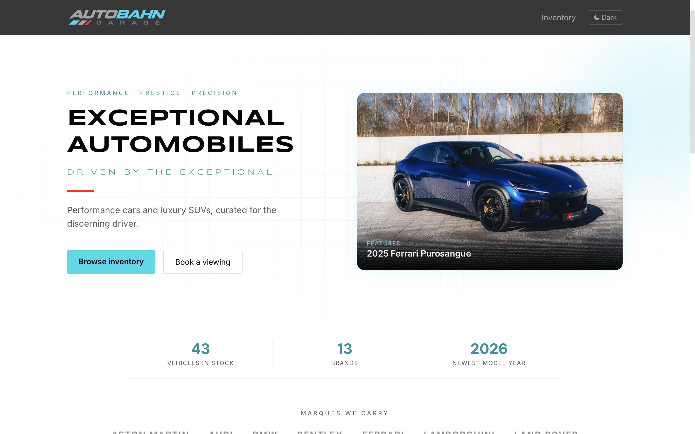

<div align="center">

# Autobahn Garage

**A premium car dealership website with live inventory search, detailed listings, and a built-in financing calculator.**

[](https://nextjs.org/)
[](https://www.typescriptlang.org/)
[](https://tailwindcss.com/)
[](https://www.netlify.com/)

[**View the live site →**](https://autobahn-garage.netlify.app)

</div>

---

## What I Built

Autobahn Garage is a full front-end build of a dealership website for a performance and luxury car inventory. Visitors can search and filter 40+ vehicles, open a detail page for any car, and estimate monthly payments with a financing calculator.

I designed and built everything from scratch: the data layer, the filtering logic, the responsive UI, a custom black, silver, and cyan brand theme with a light/dark toggle, and the image-processing pipeline. The project focused on clean architecture (all data access sits behind one module so JSON can be swapped for a database), shareable URL-driven search, and a polished, accessible interface.

**Skills demonstrated:** Next.js App Router and server components, TypeScript, Tailwind CSS, state in the URL, client components, theming with CSS variables, responsive design, image optimization, and deployment.

---

## Screenshots

| Home | Inventory |
|:---:|:---:|
|  |  |

| Car detail + financing calculator | Light mode |
|:---:|:---:|
|  |  |

---

## Features

- **Inventory search and filters:** filter by make, model, body type, price, year, and mileage, with sorting by price, year, and mileage
- **Shareable searches:** filters live in the URL (`/inventory?make=BMW&body=Coupe`), so any search can be bookmarked or shared
- **Active filter chips and empty states:** clear feedback on what's applied, with a one-click reset
- **Vehicle detail pages:** a dedicated page per car with spec chips, an inquiry button, and "You may also like" suggestions
- **Financing calculator:** monthly payment and total interest from down payment, rate, and term (includes sales tax)
- **Light and dark mode:** saved between visits, with no flash of the wrong theme on load
- **Branded design:** custom SVG logos, a cyan accent system, subtle animations, and a branded 404 page
- **Responsive and accessible:** works from phone to desktop, and respects reduced-motion settings

---

## Technical Highlights

- **Data access in one place.** Every read goes through `src/lib/cars.ts`. The inventory is a JSON file today, and moving to Postgres would only change that one file.
- **URL-driven state.** Search is a plain GET form that updates query parameters. The inventory page is a server component that reads them directly, so there's no client-side filter state to manage.
- **Theme without flicker.** Colors are CSS variables switched by a `dark` class on `<html>`. A tiny inline script applies the saved theme before first paint.
- **Image pipeline.** A script using [sharp](https://sharp.pixelplumbing.com/) batch-crops every photo to 3:2, resizes to 1800×1200, and compresses to JPG, keeping each image around 150-300 KB.
- **Typed data model.** A shared `Car` type keeps the JSON, filters, and components consistent.

---

## Tech Stack

| Area | Tools |
|---|---|
| Framework | Next.js (App Router) |
| Language | TypeScript |
| Styling | Tailwind CSS v4 |
| Images | sharp (build-time processing script) |
| Hosting | Netlify |

---

## Getting Started

```bash
# 1. Clone the repo
git clone https://github.com/Spencer1923/Autobahn-Garage.git
cd Autobahn-Garage

# 2. Install dependencies
npm install

# 3. Start the dev server
npm run dev
```

Open [http://localhost:3000](http://localhost:3000).

**Processing new photos (optional):** put originals in `raw-images/`, named to match the `image` field in `src/data/cars.json`, then run:

```bash
node scripts/process-images.mjs
```

Optimized images are written to `public/cars/`.

---

## Project Structure

```
src/
  app/
    page.tsx              # Home: hero, stats, brands, featured cars
    inventory/
      page.tsx            # Search, filters, results
      [id]/page.tsx       # Vehicle detail page
    not-found.tsx         # Branded 404
    layout.tsx            # Header, footer, theme setup
  components/
    CarCard.tsx
    FinanceCalculator.tsx
    ThemeToggle.tsx
  data/cars.json          # Inventory data
  lib/cars.ts             # Types, filtering, sorting, lookups
scripts/
  process-images.mjs      # Batch image resize and compress
public/
  cars/                   # Optimized vehicle photos
  logos/                  # Brand SVGs
```

---

## Roadmap

- Move inventory to a database (Postgres) with an admin view for managing listings
- Contact and test-drive request form
- Multiple photos per vehicle with a gallery
- Saved and favorite vehicles

---

## Note

Inventory data, prices, and photos are sample content for demonstration purposes and do not represent real listings.

---

<div align="center">

Built by [Spencer](https://github.com/Spencer1923)

</div>
